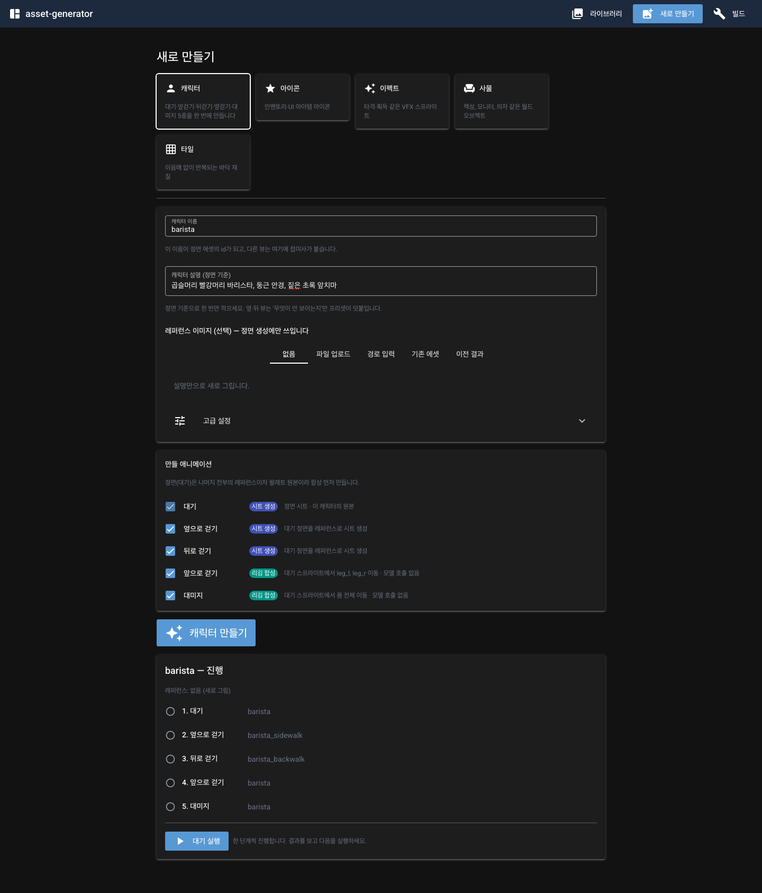
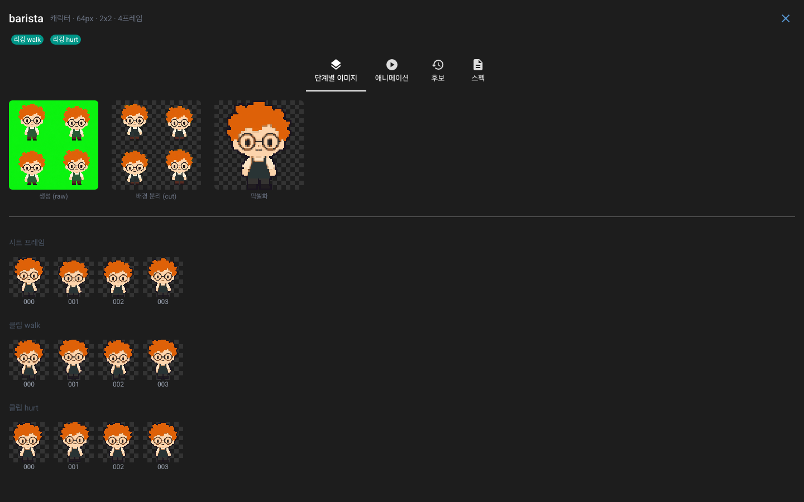
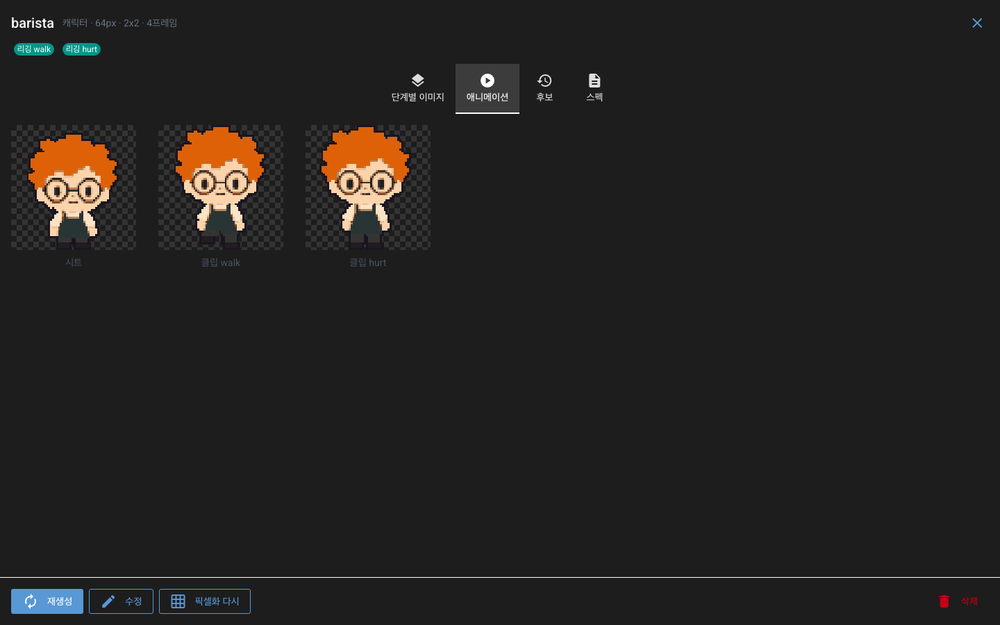
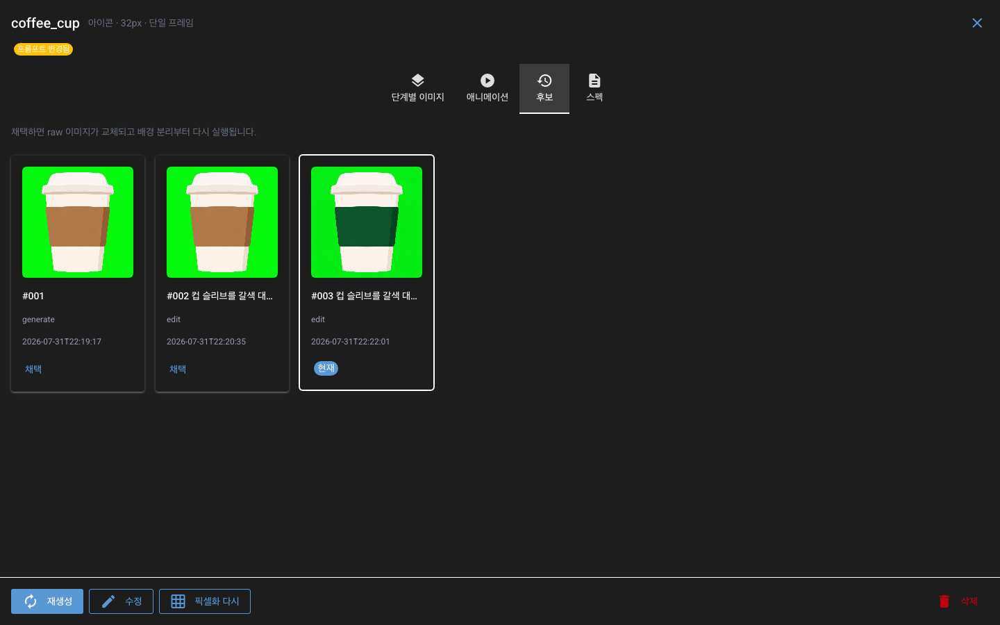
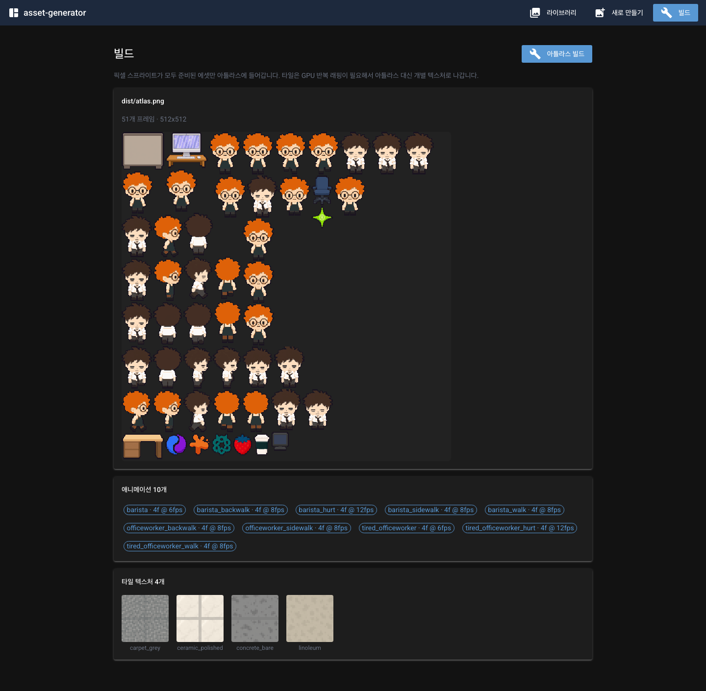
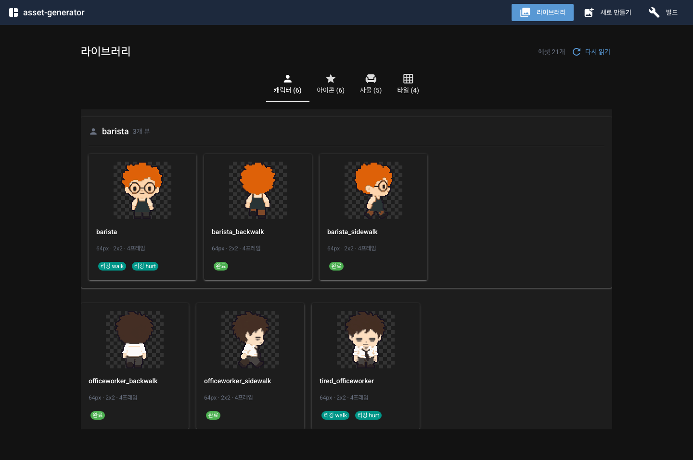

# asset-generator

파이프라인은 그대로, 사람이 볼 수 있게. 캐릭터 설명 한 문단을 넣으면 애니메이션 9종이
나오고, 각 단계의 중간 산출물을 눈으로 확인한 뒤 다음으로 넘어갑니다.

```
uv run app.py          # http://localhost:8111
```

`asset-pipeline/`은 손대지 않습니다. 두 도구는 각자의 `assets/`와 `dist/`를 가집니다.

## 필요한 것

- Python ≥ 3.11, [uv](https://docs.astral.sh/uv/)
- `codex` CLI (ChatGPT 로그인 상태). 이미지 생성은 codex의 `image_gen` 툴을 씁니다
- codex의 imagegen 스킬에 딸린 `remove_chroma_key.py`
  (`~/.codex/skills/.system/imagegen/scripts/`). 위치가 다르면 `CODEX_HOME`을 설정하세요

---

# 사용법

## 1. 만들기



카테고리를 고르고, id와 설명을 씁니다. **설명에는 생김새만 적으세요** — 화풍·셰이딩·배경
규칙은 `prompts/`가 이미 정하고 있어서, 여기에 다시 쓰면 서로 싸웁니다.

캐릭터를 고르면 만들 애니메이션 9종이 계획표로 뜨고, 각 줄이 **모델을 부르는지 아닌지**를
알려줍니다. `시트 생성` 5줄만 codex를 호출하고 `리깅 합성` 4줄은 이미 만들어진 스프라이트를
잘라 옮기는 것이라 호출이 없습니다.

"캐릭터 만들기"를 누르면 실행 패널이 열리는데, **한 번에 한 단계만** 진행합니다. 정면이
마음에 들지 않으면 옆·뒤를 만들기 전에 되돌리는 게 맞습니다 — 그 뒤의 모든 뷰가 정면을
베껴 그리기 때문입니다. 그래서 다음 단계 버튼 옆에는 항상 직전 단계 재생성 버튼이 같이
있습니다.

기본값을 바꾸려면 "고급 설정"을 펼칩니다. `size`, `key_color`, `background` 같은 것들이고,
비워두면 `pipeline.toml`의 카테고리 기본값을 씁니다.

## 2. 레퍼런스 이미지 붙이기

네 가지 방법이 있고, 어느 쪽이든 생성 전에 에셋 디렉터리 안으로 **복사**됩니다. codex는
저장소 루트에서 샌드박스로 돌기 때문에 바깥 경로의 파일은 열지 못합니다.

| 탭 | 쓰는 곳 |
|---|---|
| 파일 업로드 | 손에 있는 이미지 파일 → `work/ref_external.png` |
| 경로 입력 | 저장소 밖 경로도 됩니다. 같은 자리로 복사합니다 |
| 기존 에셋 | 라이브러리에 있는 다른 에셋 (`reference_from`) |
| 이전 결과 | 보관된 후보 중 하나 |

캐릭터에서는 레퍼런스가 **정면 생성에만** 쓰입니다. 옆·뒤는 무조건 정면을 봅니다.

## 3. 보기와 고치기



라이브러리에서 카드를 누르면 상세가 열립니다. `단계별 이미지` 탭은 생성 → 배경 분리 →
픽셀화를 나란히 놓습니다. 뭔가 잘못됐을 때 **어느 단계에서 깨졌는지**가 여기서 바로
보입니다 — 초록이 남아 있으면 키 컬러 문제, 실루엣이 뭉개졌으면 픽셀화 설정 문제입니다.
그 아래에는 시트 프레임과 리깅 클립의 전체 프레임이 깔립니다.



`애니메이션` 탭은 실제 프레임 레이트로 GIF를 돌립니다. 워크사이클이 미끄러지는지, 피격이
너무 빠른지는 정지 프레임으로는 알 수 없습니다.



`후보` 탭에는 그 에셋을 만들거나 고칠 때마다 남은 결과가 전부 있습니다. `채택`을 누르면
그 이미지가 현재 버전이 되고 배경 분리부터 다시 돌아갑니다. **되돌리는 데 모델 호출이 들지
않습니다.**

아래 버튼들이 하는 일:

- **재생성** — 같은 프롬프트로 다시 그립니다. 결과는 새 후보가 됩니다
- **수정** — 지금 이미지를 codex에 보여주고 "이것만 바꿔라"를 지시합니다.
  ("컵 슬리브를 짙은 초록색으로") 나머지는 건드리지 않습니다
- **픽셀화 다시** — 모델 호출 없이 배경 분리부터 다시. `asset.toml`의 `size`나 `[rig]`를
  손으로 고친 뒤에 씁니다
- **삭제** — 다른 에셋이 이 에셋을 레퍼런스나 팔레트 원본으로 쓰고 있으면 경고합니다

## 4. 빌드



패킹 → 타일 심 검사 → 검증을 한 번에 돌립니다. 타일이 실제로 wrap 되는지는 게임이 반복해서
깔기 전까지 드러나지 않으므로 빌드 시점에 잡습니다.

픽셀 스프라이트가 준비된 에셋만 들어갑니다. 라이브러리에서 `픽셀화 안 됨` 배지가 붙은 것은
그냥 빠집니다.

---

# 어떻게 돌아가는가

## 파이프라인

에셋 하나가 디렉터리 하나입니다. 경로가 곧 정체성이라 폴더 이름이 id, 그 부모가 카테고리입니다.

```
프롬프트 조립 → 생성(codex) → 배경 분리 → 픽셀화 → 리깅 → 패킹
```

- **생성 이후는 전부 결정적**입니다. 같은 입력이면 같은 바이트가 나오므로 뒷단은 언제든 다시 돌려도
  안전합니다
- **아웃라인은 그리지 않고 나중에 붙입니다.** 다운스케일이 그려진 선을 뭉개므로, 생성은 lineless로
  하고 `pixelize`가 1px 아웃라인을 다시 세웁니다
- **애니메이션 프레임은 두 갈래**입니다. 시트는 모델이 rows×cols 격자 한 장으로 그리고
  (`slice_sheet` → `register` → `common_crop`), 리깅은 완성된 스프라이트에서 사각형을 정수
  픽셀만큼 옮겨 합성합니다. 리샘플링이 없어 원본만큼 깨끗합니다

## 캐릭터 9종



`presets/character.toml`이 무엇을 어떤 순서로 만들지 정합니다. 새 애니메이션(공격, 죽음 등)은
이 파일에 블록을 추가하면 되고, 파이썬은 건드릴 필요가 없습니다.

| 애니메이션 | 방식 | 레퍼런스 |
|---|---|---|
| 대기 (idle) | 시트 생성 2x2 | 첨부한 이미지 (선택) |
| 옆으로 서기 | 시트 생성 **1x1** | 대기 정면 |
| 옆으로 걷기 | 시트 생성 2x2 | 대기 정면 |
| 뒤로 서기 | 시트 생성 **1x1** | 대기 정면 |
| 뒤로 걷기 | 시트 생성 2x2 | 대기 정면 |
| 옆으로 서기 호흡 | 리깅 | 옆으로 서기 스프라이트 |
| 뒤로 서기 호흡 | 리깅 | 뒤로 서기 스프라이트 |
| 앞으로 걷기 | 리깅 | 대기 스프라이트 |
| 대미지 | 리깅 | 대기 스프라이트 |

**서 있는 포즈는 한 장만 그리고 호흡은 리깅으로 붙입니다.** 격자를 네 칸 달라고 하면
모델은 캐릭터를 네 번 그립니다. 정면은 캐릭터가 넓어서 그 편차가 묻히지만, 옆모습은
실루엣이 좁아 머리카락이 한 칸에서 1px 넓게 나온 것이 **몸 전체가 부풀었다 줄어드는**
것으로 읽힙니다. 프롬프트로는 안정적으로 못 막습니다 — 실수가 아니라 같은 것을 네 번
그리면 나오는 결과이기 때문입니다.

그래서 포즈는 한 칸으로 그리고, 호흡은 `upper`(다리가 시작하는 행 위쪽 전부)를 1~2px
내리는 리그 클립으로 만듭니다. 리깅 프레임은 같은 픽셀을 정수만큼 옮긴 것이라 프레임
사이에 실루엣이 달라질 수가 없고, "발은 붙어 있고 몸이 가라앉는다"는 표현이 그대로
됩니다. 위가 아니라 아래로 내리는 이유는 스프라이트가 프레임을 꽉 채우기 때문입니다 —
위로 올리면 머리가 상단에서 잘립니다.

**리그는 정면 전용이 아닙니다.** 클립은 자신이 잘라 쓰는 스프라이트의 스펙에 저장되고,
파트 사각형도 그 스프라이트에서 측정합니다.

**정면이 캐릭터입니다.** 먼저 그려지고, 나머지 뷰는 전부 그 그림을 레퍼런스와 팔레트 원본으로
삼습니다. 그래서 디자인은 한 번만 정해지고 이후로는 포즈만 바뀝니다. 사용자는 정면 기준 설명을
한 번만 쓰고, 시점이 바뀌는 뷰에는 프리셋의 `view_note`("무엇이 안 보이는지")가 덧붙습니다.

한 캐릭터의 뷰들은 `group`으로 묶여 라이브러리에 한 카드로 모입니다. 손으로 쓴 스펙에는
`group`이 없으므로 (위 스크린샷의 officeworker처럼) 낱개로 놓입니다.

리그 파트는 `rig.suggest_parts()`가 완성된 스프라이트를 프로파일링해 추정합니다. 측정은
하나뿐입니다 — **다리가 시작하는 행**. 그 아래가 `leg_l`/`leg_r`, 그 위 전부가 `upper`입니다.
못 찾으면 조용히 넘어가지 않고 멈추므로, `asset.toml`의 `[rig] parts`를 직접 적은 뒤 라이브러리에서
"픽셀화 다시"를 누르면 됩니다.

## 후보 이력

모델 호출은 느리고 같은 결과를 두 번 주지 않으므로, 생성할 때마다 결과를 번호가 붙은 디렉터리에
보관합니다. `raw.png`는 그중 채택된 것의 복사본입니다.

```
assets/<category>/<id>/
  raw.png                     채택된 것
  candidates/001/ 002/ ...    raw.png, prompt.txt, meta.json
```

## 수정

기존 이미지를 codex에 `view_image`로 보여주고 "이것만 바꿔라"를 지시합니다
(`prompts/_edit.md`). 시트는 첫 셀이 아니라 전체를 보여줍니다 — 프레임 간 정합이 유지되어야
하기 때문입니다. 수정 전 이미지는 후보로 남습니다.

## 산출물

`/build`가 `dist/`에 씁니다.

| 파일 | 용도 |
|---|---|
| `atlas.png` + `atlas.json` | TexturePacker JSON Hash. Phaser `load.atlas`, PixiJS `Assets.load`가 그대로 읽습니다 |
| `animations.json` | Phaser `anims.fromJSON` 페이로드 |
| `atlas.d.ts` | 프레임 키·애니메이션 키 union 타입 |
| `tiles/*.png` | 타일은 아틀라스에 넣지 않습니다. GPU 반복 래핑에는 자기 텍스처가 필요하고, 패킹의 1px 익스트루드가 없어야 할 이음매를 만들기 때문입니다 |
| `backgrounds/*.png` | 생성 후 전체 화면을 색상 양자화·픽셀화한 독립 배경 텍스처입니다 |

## 설정

`pipeline.toml`이 전역·카테고리 기본값을, `assets/<...>/asset.toml`이 에셋별 재정의를 담습니다.
자주 만지는 것:

- `size` — prop은 이 값이 곧 **상대 스케일**입니다. 모든 스프라이트가 자기 캔버스를 채우도록
  스케일되므로, 모니터를 캐릭터보다 작게 하려면 캔버스를 줄입니다 (모니터 28, 의자 44)
- `key_color` — 피사체 자체가 초록이면 `#ff00ff` 등으로 바꿉니다. 안 그러면 배경과 함께
  피사체까지 지워집니다
- `background` — `chroma`(키 색상 제거) / `flood`(테두리부터 채우기, 손으로 그린 흰 배경 아트용) /
  `opaque`(분리할 바깥 배경 없음, 타일·전체 화면 배경)
- `align` — 시트 프레임 간 드리프트 보정. `bottom-center`는 발을 공통 베이스라인에 고정합니다

## 구조

```
core/     파이프라인. NiceGUI를 import하지 않습니다
ui/       화면. 진행 상황은 콜백으로만 코어에서 받습니다
prompts/  프롬프트 템플릿 (화풍·셰이딩·배경 규칙)
presets/  캐릭터 애니메이션 레시피
docs/     README 스크린샷
```
